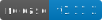

# Système de Design de l’État Français pour l'ADEME

[](https://GitHub.com/gouvernementFR/dsfr/releases/) [](https://github.com/GouvernementFR/dsfr/blob/main/LICENSE.md)

Le Système de Design de l’État (ci-après, le **DSFR**) est un ensemble de composants web HTML, CSS et Javascript pour faciliter le travail des équipes projets des sites Internet publics, et créer des interfaces numériques de qualité et accessibles.

L'outil est développé, maintenu et géré par le [Service d'Information du Gouvernement (SIG)](https://www.gouvernement.fr/service-d-information-du-gouvernement-sig).

Son utilisation par les administrations est soumise à une demande d'agrément (voir partie 5 des Conditions Générales d'Utilisation).

[Voir la documentation officielle](https://www.systeme-de-design.gouv.fr).

## Licence et droit d'utilisation

Le contenu de ce projet est placé sous licence MIT License, à l'exception de la fonte Marianne. Voir [LICENSE.md](https://github.com/GouvernementFR/dsfr/blob/main/LICENSE.md).

#### ⚠️ Utilisation interdite en dehors des sites Internet de l'État

>Il est formellement interdit à tout autre acteur d’utiliser le Système de Design de l’État (les administrations territoriales ou tout autre acteur privé) pour des sites web ou des applications. Le Système de Design de l’État représente l’identité numérique de l’État. En cas d’usage à des fins trompeuses ou frauduleuses, l'État se réserve le droit d’entreprendre les actions nécessaires pour y mettre un terme.

Voir les [conditions générales d'utilisation](doc/legal/cgu.md).

#### ⚠️ Prohibited Use Outside Government Websites

>This Design System is only meant to be used by official French public services' websites and apps. Its main purpose is to make it easy to identify governmental websites for citizens. See terms.

## Démarrage

**Prérequis :**
- Installer [VSCode](https://code.visualstudio.com/) (ou un autre éditeur de texte équivalent).
- Installer [Github Desktop](https://desktop.github.com/download/).

### GIT Clone

Une fois que vous disposez des droit de contribution au projet (contactez votre responsable ADEME dans le cas contraire), la prochaine étape consiste à cloner ce projet sur votre environnement local. Pour cela, depuis le dossier local ou vous souhaitez travailler, entrez la commande suivante dans un terminal :

```
git clone <URL_DU_PROJET>
```

🙌 Vous pouvez désormais ouvrir le nouveau dossier du projet créé dans votre éditeur préféré et travailler sur les fichiers.

### Déploiement

#### 1. ⚠️ Avant le développement
- Lancez GitHub Desktop et ouvrez le projet en cours;
- Cliquer sur `Branch` puis `New Branch` pour créer une nouvelle branche de développement indépendante à partir de `Main` (dernière version stable en PROD);
- Nommer la branche selon l'US en cours (par exemple, `CRM-1470`) et validez;
*❗Si des des développements non sauvegardées existent, un message demande ce que vous souhaitez faire des modifications en cours. Cliquez sur `Bring my changes to CRM-XXXX` pour ne pas perdre le travail en cours.*
- Faites un **pull origin** en cliquant sur `Fetch origin` pour récupérer les dernières modifications de la branche DEV depuis GitLab.

#### 2. Créer une branche de développement spécifique à votre US
- Toujours dans GitHub Desktop, cliquer sur `Branch` puis `New Branch`.

- S'assurer que la nouvelle branche est basée sur DEV.

🙌 Vous pouvez désormais cliquer sur `Open in VS Code` et commencer à développer.

#### 3. Développer la fonctionnalité
- Effectuer les modifications dans le code.
- Tester les modifications localement pour assurer leur bon fonctionnement.

#### 4. Commiter les modifications
- Dans GitHub Desktop, sélectionner les fichiers modifiés.
- Rédiger un message de commit clair et descriptif.
- Cliquer sur **Commit to [nom de ta branche]**.

#### 5. Pousser les modifications
- Cliquer sur **Push origin** pour envoyer la branche de fonctionnalité sur GitLab.

#### 6. Créer une merge request (MR)
- Accéder au projet sur GitLab.
- Naviguer vers l'onglet **Merge Requests**.
- Cliquer sur **New Merge Request**.
- Sélectionner la branche de fonctionnalité comme source et DEV comme cible.
- Remplir les détails de la MR et la créer.

#### 7. Revue de code
- Demander une revue de code à un autre développeur.
- Intégrer les commentaires et les modifications suggérées.

#### 8. Fusionner la MR
- Une fois approuvée, fusionner la MR dans la branche DEV.
- S'assurer que tout fonctionne correctement après la fusion.

#### 9. Déployer sur la branche main
- Vérifier que la branche DEV est à jour avec les dernières modifications.
- Créer une nouvelle MR pour fusionner DEV dans main.
- Suivre le même processus de revue et de fusion.

#### 10. Vérifications post-déploiement
- Vérifier que l'application fonctionne correctement sur la branche main après le déploiement.
- Effectuer des tests supplémentaires si nécessaire.

### Mise à jour du DSFR

**Prérequis :**
- Installer [Node.js](https://nodejs.org/fr).

Pour mettre à jour le DSFR, vous pouvez utiliser les commandes suivantes dans un terminal depuis la racine du projet.

Pour vérifier si la dernière version est installée :

```
npm run check-dsfr-version
```

Pour installer la dernière version :

```
npm run dl-last-dsfr-version
```

***Remarque :*** *Une nouvelle version n'écrase jamais la précédente ! Un nouveau dossier de version est crée sous `dsfr/`* 

## Structure du DSFR de l'ADEME

```
/ Racine du projet
└── customs/
└── dsfr/
  └── vX.X.X/
    └── dsfr.min.css
    └── dsfr.module.min.js
    └── dsfr.nomodule.min.js
    └── icons/
    └── favicon/
    └── fonts/
    └── utility/
      └── utility.min.css
└── images/
└── ademe.main.css
└── ademe.main.js
```

### Structure de base du DSFR

L'ensemble des ressources utiles du DSFR sont copiées sous `dsfr/` et sont **versionnées** dans les sous-dossiers `vX.X.X/`.

Les polices de caractères utilisées sur le DSFR, à savoir la Marianne et la Spectral, sont des fichiers .woff et .woff2, ils doivent se trouver dans le répertoire `fonts/`. Les dossiers `fonts/` et `favicon/` doivent être placés sous `dsfr/vX.X.X/`.

Le fichier `utility.min.css` doit être placé un niveau plus bas que le dossier `icons/`, dans dossier `utility/` par exemple, pour respecter les chemins d'accès vers les icônes.

⚠️ Les ressources sous `dsfr/` **ne doivent pas être modifiées**.

### Ressources ADEME

Pour ajuster le style et le comportement du DSFR **sur l'ensemble des pages WEB de l'ADEME**, nous utilisons les fichiers `ademe.main.css` et `ademe.main.js` sous `commons/`. 

Pour les ressources CSS/JS communes à certains composants tel que l'iframe resizer, les fichiers devront être placés dans `utils/`.

Pour des ajustements du DSFR spécifiques à certaines pages, les fichiers devront être placés sous `customs/`.

Les ressources images complémentaires du DSFR pourront être chargées dans le dossier `images/`

⚠️ Les modifications apportées à des ressources communes à plusieurs pages peuvent produire des regressions.

### Intégration HTML

Pour utiliser les ressources du DSFR sur les pages ADEME, les fichiers sont à intégrer dans les fichiers HTML comme l'exemple ci dessous.

Afin d’inclure la totalité des composants et des styles du système de design, il est nécessaire d’inclure la feuille de style `dsfr.min.css`.
Les classes utilitaires, notamment les icônes, sont disponibles dans un fichier à part dans `utility/utility.scss`.

L’ensemble du code javascript nécessaire au bon fonctionnement du DS se trouve dans deux fichiers `dist/dsfr.module.min.js` et `dist/dsfr.nomodule.min.js`.
Le fichier dsfr.module.min.js utilise les modules javascript natifs - sa balise script d’appel doit avoir l’attribut **type=”module”**.
Le fichier dsfr.nomodule.min.js est utilisé par les anciens navigateurs ne supportant pas les modules javascript (es6) - sa balise script doit contenir l’attribut **nomodule**.
Il est **impératif** d’appeler les **deux fichiers** javascript afin que le code s’exécute correctement sur l’ensemble des navigateurs supportés.

```html
<!DOCTYPE html>
<html lang="fr">
  <head>
    <meta charset="utf-8">
    <meta name="viewport" content="width=device-width, initial-scale=1, shrink-to-fit=no">
    <meta name="robots" content="noindex,nofollow">
    <title>Titre de la page - Agence de la transition écologique</title>

    <!-- Favicon -->
    <link rel="icon" type="image/png" href="https://image.contact.ademe.fr/lib/fe36117175640479761276/m/1/favicon.png">

    <!-- Feuilles de Styles DSFR -->
    <link rel="stylesheet" href="https://<URL_GITLAB>/refs/heads/<BRANCH>/dsfr/<VERSION>/dsfr.min.css">
    <link rel="stylesheet" href="https://<URL_GITLAB>/refs/heads/<BRANCH>/dsfr/<VERSION>/utility/ademe.utility.min.css">

    <!-- Feuille de Styles commune à toutes les CloudPages ADEME -->
    <link rel="stylesheet" href="https://<URL_GITLAB>/refs/heads/<BRANCH>/commons/ademe.main.css">
    
    <!-- Style spécifique à cette page -->
    <link rel="stylesheet" href="https://<URL_GITLAB>/refs/heads/<BRANCH>/customs/example.custom.css">

    <!-- Style spécifique à cette page inline -->
    <style></style>

  </head>
  <body>

    <!-- Code de la page -->

    <!-- Script DSFR en version es6 module et nomodule pour les navigateurs le ne supportant pas -->
    <script type="module" src="https://<URL_GITLAB>/refs/heads/<BRANCH>/dsfr/<VERSION>/dsfr.module.min.js"></script>
    <script type="text/javascript" nomodule src="https://<URL_GITLAB>/refs/heads/<BRANCH>/dsfr/<VERSION>/dsfr.nomodule.min.js"></script>

    <!-- Script spécifique à cette page -->
    <script type="text/javascript" src="https://<URL_GITLAB>/refs/heads/<BRANCH>/commons/ademe.main.js"></script>
    
    <!-- Script spécifique à cette page inline -->
    <script></script>
    
    <!-- Script pour le redimensionnement de l'iframe (UNIQUEMENT POUR lES IFRAMES) -->
    <script type="text/javascript" src="https://<URL_GITLAB>/refs/heads/<BRANCH>/utils/ademe.iframe.resize.js"></script>
  </body>
</html>
```

### Icônes

Les icônes sont stockées dans `icons/` et classées par catégories.

Le design système utilise principalement des icônes de la librairie remixIcon. Il existe aussi des icônes personnalisées, celles-ci sont préfixée par “fr--”.

Afin d’utiliser ces icônes, des classes utilitaires CSS sont associés à chaque icône. Par ex. : `fr-icon-error-fill`

Ces classes sont disponibles dans `utility` qui importe `utility/icons/icons.css`.

Pour plus d’informations : [Voir la documentation des icônes](https://www.systeme-de-design.gouv.fr/elements-d-interface/fondamentaux-techniques/icones).

## Fonctionnement

### BEM

Le **DSFR** utilise la méthodologie [**BEM**]([https://css-tricks.com/bem-101/]([http://getbem.com/naming/](http://getbem.com/naming/))) (Block - Element - Modifier) comme convention de nommage des classes CSS. Elle permet aux développeurs une meilleure compréhension de la relation entre HTML et CSS dans un projet donné.

Selon cette méthodologie, un block représente le plus haut niveau d'abstraction d'un nouveau composant, par exemple `.parent`.

Des éléments (ou enfants), peuvent être placés à l'intérieur de ces blocks, et sont désignés par deux underscore précédés du nom du block : `.parent__element`.

Les modifiers quant à eux, servent à manipuler les blocs, de manière à les styliser de manière indépendante en s'assurant de ne pas induire de changement à des blocks sans aucun rapport avec celui-ci. Ils sont notés à l'aide de deux tirets précédés du nom du block comme suit : `.parent--modifier`.

### Composants

Le **DSFR** est constitué de différents composants, que vous pouvez utiliser indépendamment au sein de votre projet.

Une documentation spécifique est prévue pour chaque composant, précisant ses principes d’utilisation, ainsi que les snippets de code HTML à utiliser pour votre projet.

🙌 Vous êtes maintenant prêt(e) à utiliser le **DSFR**.

### Thèmes clair et sombre

L’ajout de l’attribut **data-fr-scheme** sur la balise html permet d’activer la gestion des thèmes clair et sombre. Les valeurs possibles sont `system`, `light`, `dark`. La valeur “system” permet d’utiliser la configuration définie sur le système d’exploitation de l’utilisateur.

Consulter la [documentation des paramètres d’affichage](https://www.systeme-de-design.gouv.fr/elements-d-interface/composants/parametre-d-affichage) afin d’en savoir plus.

## Documentation

[Documentation développeurs](https://www.systeme-de-design.gouv.fr/utilisation-et-organisation/developpeurs/)